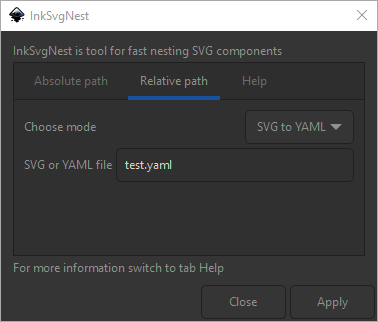

# InkSvgNest

InkSvgNest is tool for backup nesting configuration.
It is used to easily save, read and edit the position of individual objects in the file.
The extension simplifies the prototyping of parts that are precisely nested on the work plane.

## Installation
Copy files from folder `InkSvgNest` to specify folder.

* Linux - `~/.config/inkscape/extensions` or `/usr/share/inkscape/extensions`
* Windows - `C:\Program Files\Inkscape\share\extensions`

## Usage

### Original SVG to new SVG
The extension reads original nested version and tries to apply same coordination to opened objects.

### SVG to YAML with coordinates
The extension reads the coordinates of the currently open file and saves them in a YAML file in the format `"Object name"->"Coordinates"`.

### YAML with coordinates to SVG
The opposite variant to the previous option. Extension opens a YAML file with coordinates and tries to apply them to the open file according to the object name.

## Options
### Absolute path
When selecting, it is necessary to select the full path to a specific folder and in it the file to / from which the file is saved / read.
The colon is used for graphical selection of the path.
If the required file does not exist, it is created, otherwise the file is overwritten.

### Relative path
By relative path is meant the same folder as for the currently open file.