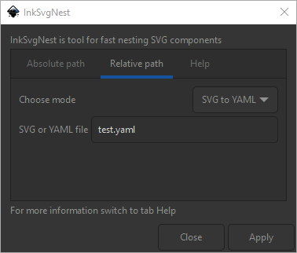

# InkSvgNest

InkSvgNest je transformační doplněk pro zálohu nestovaného rozvržení na ploše.
Slouží k jednoduchému ukládání, čtení a upravování pozice jednotlivých objektů v souboru.
Rozšíření zjednodušuje prototypování dílů, které jsou přesně rozmístěné na pracovní poše.

## Instalace
Obsah složky `InkSvgNest` nakopírujte do níže specifikovaného místa.

* Linux - `~/.config/inkscape/extensions` or `/usr/share/inkscape/extensions`
* Windows - `C:\Program Files\Inkscape\share\extensions`

## Použití

### Původní SVG na nové SVG
Rozšíření načte předchozí nanestovanou verzi souboru a pokusí se aplikovat veškeré transformace i na právě otevřený soubor.

### SVG na souřadnicový YAML
Rozšíření přečte souřadnice právě otevřeného souboru a uloží je do YAML souboru ve formátu `"Název objektu" -> "Souřadnice"`.

### Souřadnicový YAML na SVG
Opačná varianta k k předchozí volbě otevře YAML soubor se souřadnicemi a pokusí se je podle názvu objektu aplikovat na otevřený soubor.

## Varianty

### Absolutní cesta
Při výběru je nutné vybrat celou cestu k konkrétní složce a v ní i soubor do/z kterého se soubor uloží/přečte.
Trojtečka slouží ke grafickému výberu cesty.
Pokud požadovaný soubor neexistuje je vytvořen, v opačném případě je soubor přepsán.

### Relativní cesta
Relativní cestou je myšlena stejná složka jako pro aktuálně otevřený soubor.